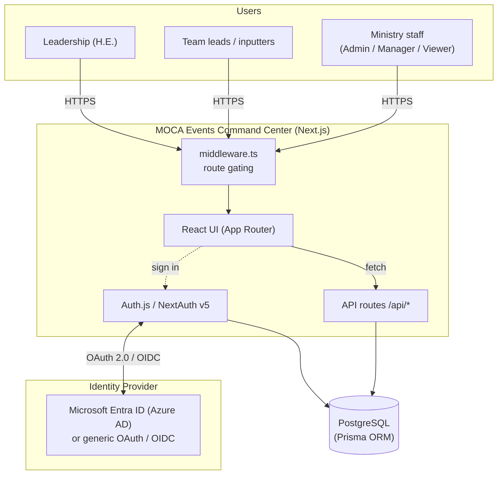
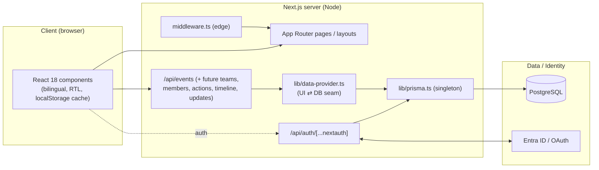
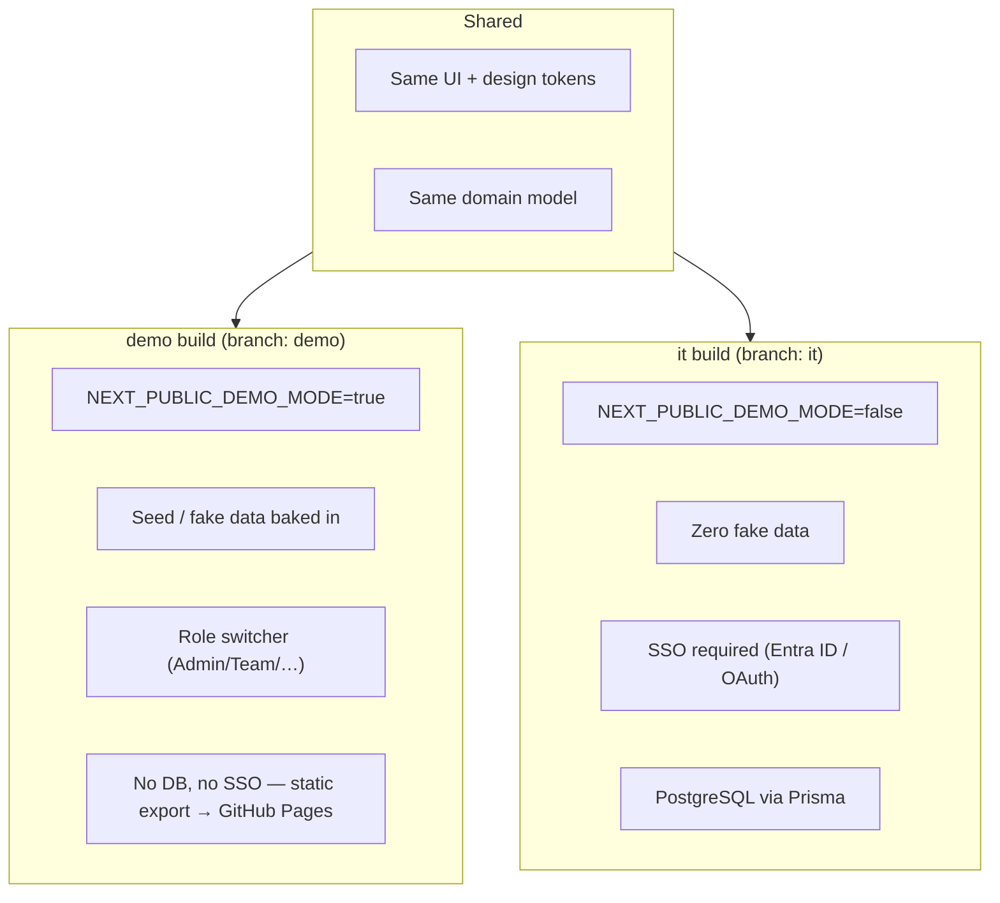
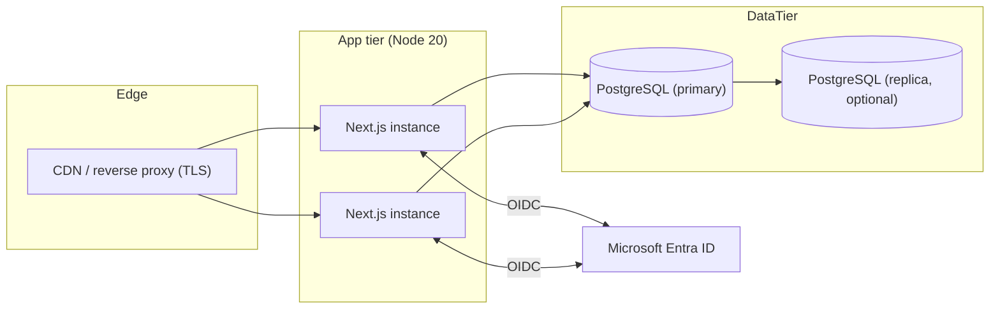

# Architecture — MOCA Events Command Center

Bilingual (EN / العربية, RTL-aware) executive events command center for the UAE Ministry
of Cabinet Affairs. This document describes the target production architecture on the
**`it`** branch (Next.js + PostgreSQL + SSO) and how the demo build relates to it.

---

## 1. System context

---

## 2. Application layers

| Layer | Tech | Responsibility |
|---|---|---|
| UI | Next.js 15 App Router, React 18, TypeScript | Screens, bilingual/RTL, client interactions |
| Styling | Verbatim design CSS tokens (`globals.css`) | Pixel-perfect match to the approved design |
| Auth | Auth.js / NextAuth v5 | SSO (Entra ID + generic OAuth) + session/JWT |
| Gating | `middleware.ts` | Redirect unauthenticated users to `/signin` |
| API | Route handlers under `/api` | CRUD over domain entities |
| Data seam | `lib/data-provider.ts` | Maps DB rows ⇄ the UI's `[en, ar]` DTOs |
| ORM | Prisma | Typed DB access, migrations |
| DB | PostgreSQL | Persistent store (see `DATABASE.md`) |

---

## 3. Environments / builds

- **Live demo (Pages):** `https://txlabtesting.github.io/moca-events-command-center/`
- **`current-build/`** in this branch is the exact current shipping UI (the approved
  Claude Design build: latest redesign + timeline editing + no loading splash), provided
  so IT can run/inspect the real UI offline while the Next.js port is completed.

---

## 4. Deployment topology (target for IT)

Recommended: containerize the Next.js app (Dockerfile), run behind the ministry's
reverse proxy/WAF, connect to a managed PostgreSQL, and register the app in Entra ID
(redirect URI `https://<host>/api/auth/callback/microsoft-entra-id`).

---

## 5. Repository / branch map

| Branch | Purpose |
|---|---|
| `main` | Shared base (Next.js + Prisma + Auth scaffold) |
| `demo` | Fake data + role switcher; static export → GitHub Pages (live demo) |
| `it` | Proper architecture, zero fake data, SSO; **this branch** — includes `docs/` + `current-build/` |
| `gh-pages` | Published static site (serves the live demo build) |

See also: [`DATABASE.md`](./DATABASE.md) · [`FLOWS.md`](./FLOWS.md)
