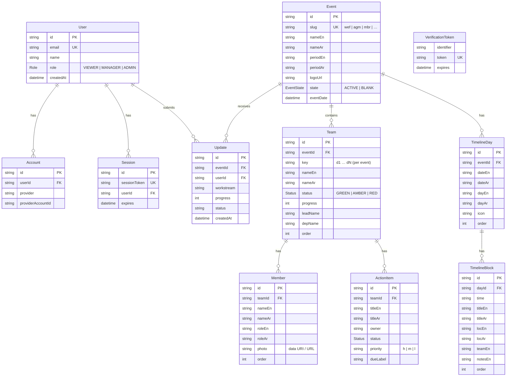
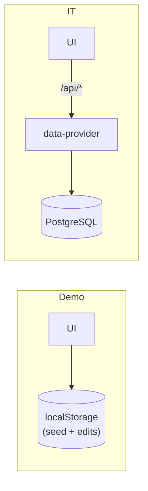

# Database — MOCA Events Command Center

PostgreSQL, accessed through **Prisma** (`prisma/schema.prisma`). Bilingual content is
stored as `*_en` / `*_ar` column pairs to match the UI's `[en, ar]` convention. Auth
models follow the Auth.js (NextAuth v5) Prisma adapter contract.

## Entity–relationship diagram



## Enums

| Enum | Values | Meaning |
|---|---|---|
| `Role` | `VIEWER`, `MANAGER`, `ADMIN` | RBAC. `MANAGER`+ unlock editing & budget breakdown. |
| `Status` | `GREEN`, `AMBER`, `RED` | On track / needs attention / at risk. |
| `EventState` | `ACTIVE`, `BLANK` | Populated event vs. empty (zero-state) event. |

## Tables (summary)

| Table | Purpose |
|---|---|
| `User`, `Account`, `Session`, `VerificationToken` | Auth.js identity & SSO linkage |
| `Event` | Top-level events (WEF, AGM, MBR, custom) |
| `Team` | Operational teams / streamlines per event |
| `Member` | Team members (workforce) |
| `ActionItem` | Per-team operational tracker rows |
| `TimelineDay` / `TimelineBlock` | Event agenda days and sessions (editable) |
| `Update` | Submitted team updates |

## Migrations & seeding

```bash
# create the schema
npx prisma migrate deploy         # prod
npx prisma migrate dev            # local (creates + applies a migration)

# generate the typed client
npx prisma generate

# provision an initial admin (IT build ships with ZERO fake data)
SEED_ADMIN_EMAIL=you@moca.gov.ae npm run db:seed
```

The IT build creates **no** sample events/teams — content is created by admins in-app and
persisted via the API / data-provider (`src/lib/data-provider.ts`).

## Data-flow (demo vs it)


