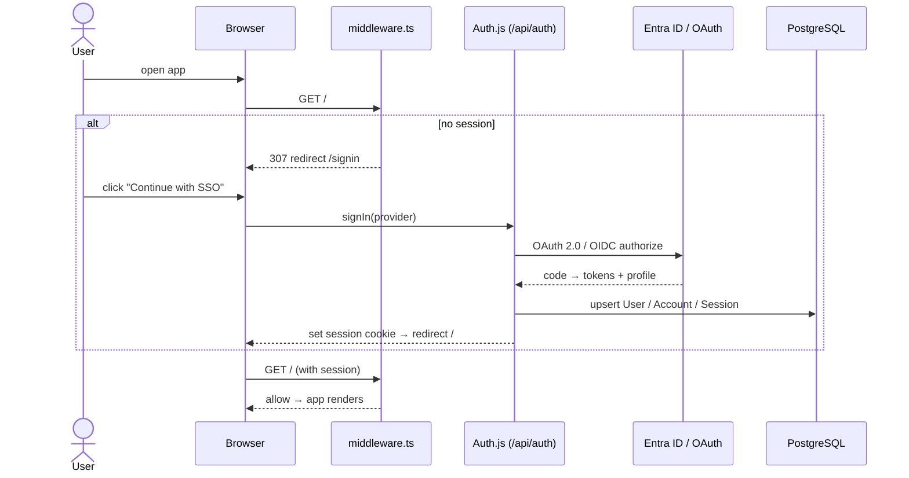
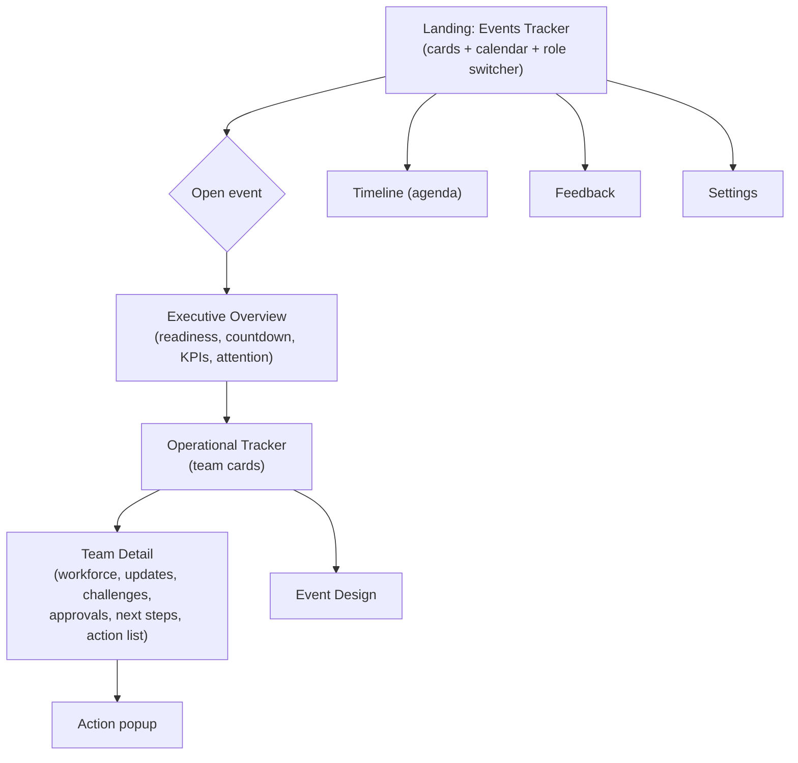
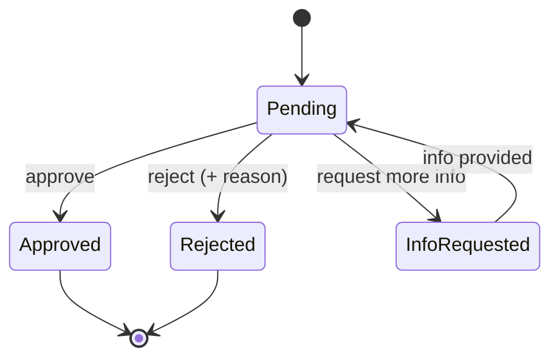
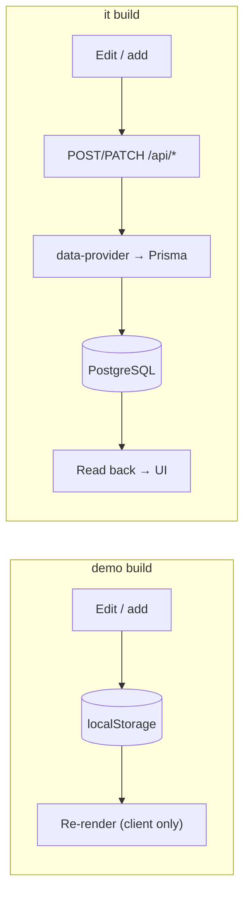
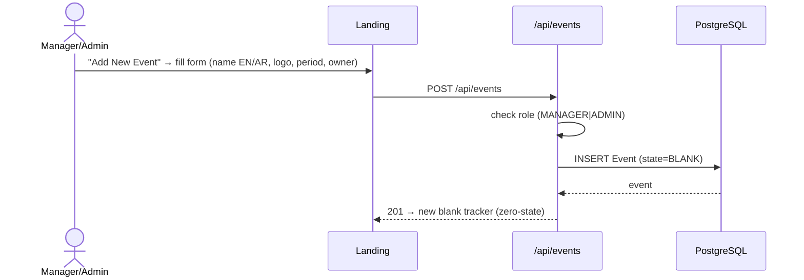

# Flows — MOCA Events Command Center

Key user and system flows. Diagrams render on GitHub (mermaid).

---

## 1. Authentication / SSO (IT build)



Roles (`VIEWER` / `MANAGER` / `ADMIN`) are carried on the session (JWT `role` claim) and
mapped from IdP claims in `src/auth.ts` → `callbacks.jwt`.

---

## 2. Navigation: events → team → detail



---

## 3. Timeline editing (Admin) — latest feature

```mermaid
sequenceDiagram
    actor A as Admin
    participant UI as Timeline page
    participant S as State + localStorage

    A->>UI: switch role → Admin
    A->>UI: open Timeline → click "Edit Timeline"
    Note over UI: edit mode on (blocks highlighted, ✎ Edit Day chips)
    alt edit a session
        A->>UI: click a session card
        UI-->>A: modal (time, title, subtitle, location, team, notes)
        A->>UI: Save Changes
        UI->>S: persist wef_tledits[event].blocks[di:bi]
    else edit a day
        A->>UI: click "✎ Edit Day"
        UI-->>A: modal (date, day title, tagline)
        A->>UI: Save Changes
        UI->>S: persist wef_tledits[event].days[di]
    end
    UI-->>A: "Timeline updated" toast; changes persist across reloads
```

*IT note:* in the production build this persistence moves from `localStorage` to
`TimelineDay` / `TimelineBlock` via `/api/*` (data-provider), gated to `MANAGER`/`ADMIN`.

---

## 4. Approvals workflow



---

## 5. Data persistence (demo vs it)



---

## 6. Event creation (Add New Event)



See also: [`ARCHITECTURE.md`](./ARCHITECTURE.md) · [`DATABASE.md`](./DATABASE.md)
